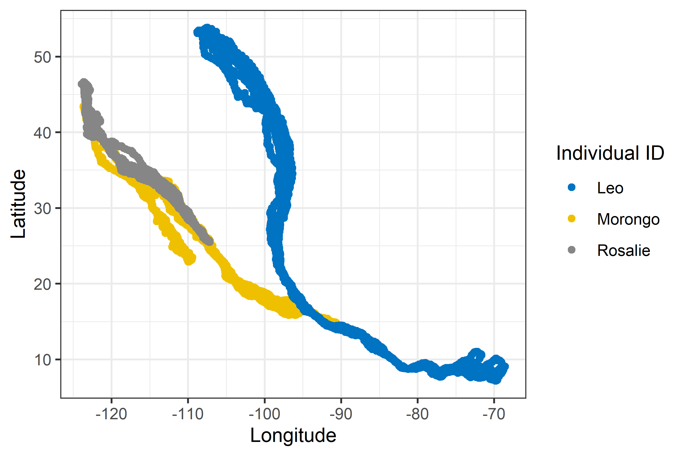
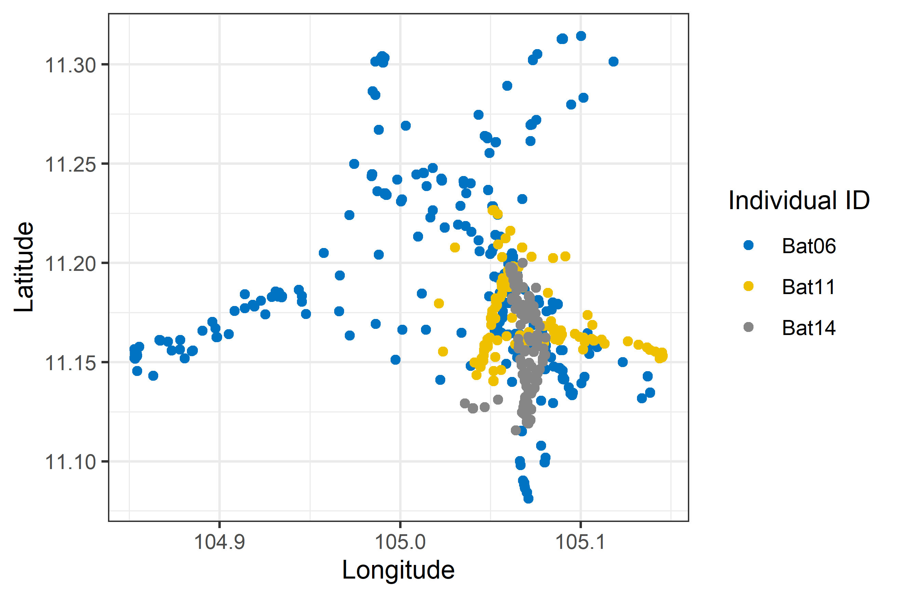
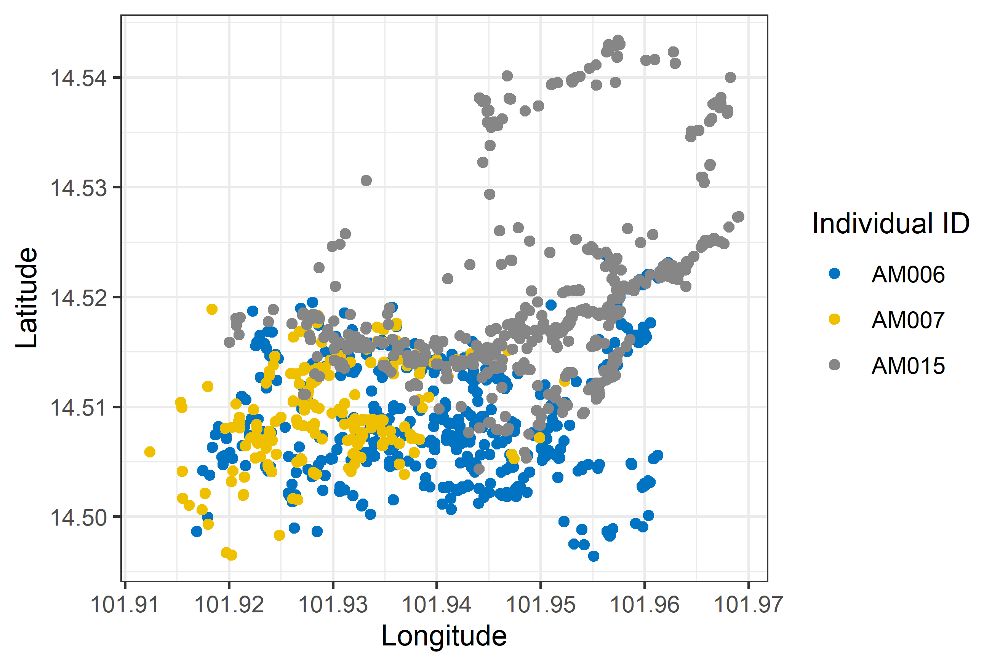

<h1 align="center">
  &nbsp;SORTEE conference July, 2021<br> Hackathon H03: Open tracking data</h1>
<div align="center">

<h2 align="center">
Overview of datasets
</div>

## R packages:

```r

# Data manipulation and visualization libraries:

requiredPackages <- c('tidyverse',
                      'ggplot2',
                      'ggsci')
for(rp in requiredPackages) {
  if(!require(rp, character.only = TRUE)) install.packages(rp)
  library(rp, character.only = TRUE)
}

# Movement/tracking data related packages (optional):

optionalPackages <- c('ctmm',
                      'move',
                      'amt')
for(op in optionalPackages) {
  if(!require(op, character.only = TRUE)) install.packages(op)
  library(op, character.only = TRUE)
}

```

## Datasets:

Turkey vultures (**Cathartes aura**) data from: Dodge *et al.* (2014)
> **Dodge** S, Bohrer G, Bildstein K, Davidson SC, Weinzierl R, Bechard MJ, Barber D, Kays R, Brandes D, Han J, Wikelski M. (**2014**). Environmental drivers of variability in the movement ecology of turkey vultures (*Cathartes aura*) in North and South America. Philosophical Transactions of the Royal Society B: Biological Sciences, 369(1643), 20130195.

Lyle's flying foxes (**Pteropus lylei**) data from: Choden *et al.* (2019) 
> **Choden** K, Ravon S, Epstein JH, Hoem T, Furey N, Gely M, Jolivot A, Hul V, Neung C, Tran A, Cappelle J.  (**2019**). *Pteropus lylei* primarily forages in residential areas in Kandal, Cambodia. Ecology and Evolution, 9(7), 4181-4191.

King cobras (**Ophiophagus hannah**) data from: Marshall *et al.* (2020)
> **Marshall** BM, Crane M, Silva I, Strine CT, Jones MD, Hodges CW, Suwanwaree P, Artchawakom T, Waengsothorn S, Goode M. (**2020**). No room to roam: king cobras reduce movement in agriculture. Movement Ecology, 8(1), 1-14.

Data files are a subset of **three individuals** from each study (based on individuals with most data points or within close proximity).

```r

# Loading case study data sets:
cathartes.aura <- read.csv("data/cathartes_aura.csv")
pteropus.lylei <- read.csv("data/pteropus_lylei.csv")
ophiophagus.hannah <- read.csv("data/ophiophagus_hannah.csv")

```

### Plotting tracks and locations:

Turkey vultures (**Cathartes aura**)
```r

ggplot(cathartes.aura) +
   geom_point(aes(x = location.long, y = location.lat, 
                  color = individual.local.identifier)) +
   labs(x = "Longitude", y = "Latitude") +
   labs(color = "Individual ID") +
   scale_color_jco() +
   theme_bw()

```


Lyle's flying foxes (**Pteropus lylei**) data from: Choden *et al.* (2019) 
```r

ggplot(cathartes.aura) +
   geom_point(aes(x = location.long, y = location.lat, 
                  color = individual.local.identifier)) +
   labs(x = "Longitude", y = "Latitude") +
   labs(color = "Individual ID") +
   scale_color_jco() +
   theme_bw()

```


King cobras (**Ophiophagus hannah**) data from: Marshall *et al.* (2020)
```r

ggplot(pteropus.lylei) +
   geom_point(aes(x = location.long, y = location.lat, 
                  color = individual.local.identifier)) +
   labs(x = "Longitude", y = "Latitude") +
   labs(color = "Individual ID") +
   scale_color_jco() +
   theme_bw()

```



```r

# Set data set to review:
tracking.data <- ophiophagus.hannah

```

### Tracking duration for each individual:


### Number of locations for each individual:


### CRS and locality:

